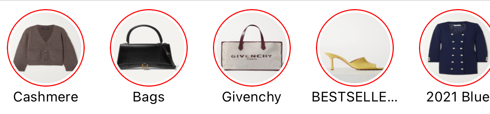

# StoriesComponent

> A reusable, independent component like Instagram Stories

- [Motivation](#motivation)

- [Why?](#why-this-project)

- [Other reasons to create this](#other-reasons-to-create-this)
        
- [Solution](#solution)

- [Installation](#installation)

- [Documentation](#documentation)

- [Inspired](#inspired)

# Motivation
Snapchat stories was a huge hit back when it was lauched on 2013. Since then, multiple apps have been releasing this feature with many flavours. Exemples like Facebook, Instagram, and recently, Revolut, LinkedIn. 

Writting this on 2021, there is not a single user that don't know how to use this super user-friendly and interactive component. This makes this piece of UI a winner by itself.

But where I see the true beauty, is when the social engineer plays it's role. Users use it as a slot machine for content ([source](https://uxdesign.cc/do-stories-make-social-media-more-addictive-3a1519983565)), making then constantly hungry for the next story. This translates on higher daily user engagement time, which should increase conversation rates also.

Although this component is mainly used on social plataforms, I see a place on e-commerce where could disrupt the old school product list page.

# Why this project?

I believe this component can be used on many contexts, not just for sharing personal photos. We can see Revolut engaging users to update the app using stories, onboarding a new feature or popup some in-app messages. And this is just some generic use cases. A bunch of scenarios for e-commerce could fly of my mind.

There isn't a implemenation (that I know of) flexible enough for every use case. And this component has a great amount of logic that could be reused and offered by a framework.

So this project will attempt to deliver the most flexible component, keeping the main flow of Stories, so that stays "native" to the users.

# Other reasons to create this

As other projects of my ownership, this will also be an excuse to improve and explore my iOS development skills. This include Documenting, exploring new features of Swift most updated versions, refine arquitecture and design patterns use, etc.

Some of this decisions could be not the best approach, and I will try to comment those as I go.

# Solution

This project contains two main targets: one is the framework itself, and other is a runnable preview where I use the framework as I would do on a external project.

The main target is also split in two important parts:

<table style="width:100%">
  <tr>
    <th><a href="StoriesComponent/Views/StoriesCollection">StoriesCollection</a></th>
    <th><a href="StoriesComponent/Views/FullscreenStories">FullscreenStories</a></th>
  </tr>
  <tr>
    <td></td>
    <td></td>
  </tr>
</table>

# Installation
// To do

# Documentation
// To do

# Inspired

Although I tried to do everything by myself as a true challenge, some minor parts of the project might have been ramp up a bit by this project: 

- [Instagram_Stories](https://github.com/drawRect/Instagram_Stories)

